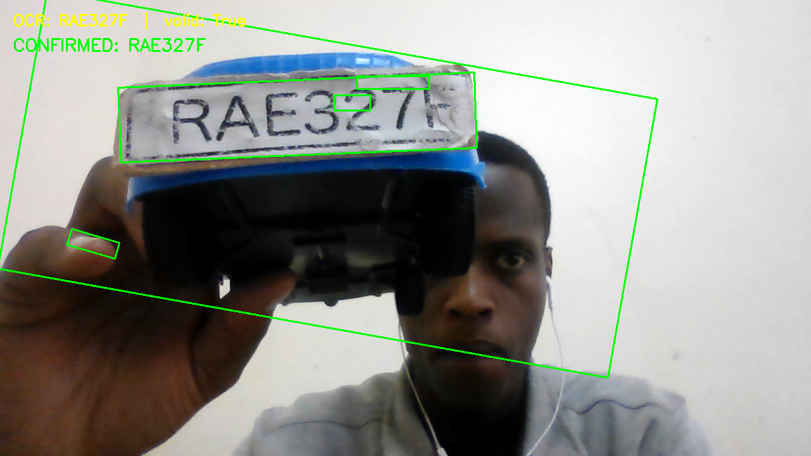
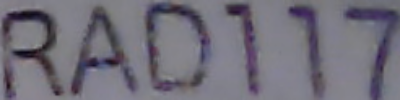
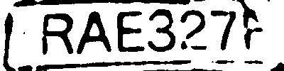

# ANPR — Car Number Plate Recognition System

A complete **Automatic Number Plate Recognition (ANPR)** pipeline implemented in Python using OpenCV and Tesseract OCR.  
Based on the book _Car Number Plate Extraction in Three Steps — Detection, Alignment, and OCR_ by Gabriel Baziramwabo.

---

## Pipeline Overview

```
Camera → Detection → Alignment → OCR → Regex Validation → Temporal Confirmation → CSV Log
```

| Stage             | File              | What it does                                            |
| ----------------- | ----------------- | ------------------------------------------------------- |
| 0 – Camera check  | `src/camera.py`   | Verifies the webcam is working                          |
| 1 – Detection     | `src/detect.py`   | Finds plate-like rectangular contours                   |
| 2 – Alignment     | `src/align.py`    | Perspective-warps the plate to 450 × 140 px             |
| 3 – OCR           | `src/ocr.py`      | Runs Tesseract on the aligned plate image               |
| 4 – Validation    | `src/validate.py` | Checks OCR output against regex `[A-Z]{3}[0-9]{3}[A-Z]` |
| 5 – Full pipeline | `src/main.py`     | All stages + temporal confirmation + CSV logging        |

---

## Project Structure

```
anpr-project/
├── README.md
├── requirements.txt
├── src/
│   ├── camera.py       ← Step 0: webcam test
│   ├── detect.py       ← Step 1: plate detection
│   ├── align.py        ← Step 2: perspective alignment
│   ├── ocr.py          ← Step 3: Tesseract OCR
│   ├── validate.py     ← Step 4: regex validation
│   └── main.py         ← Step 5: full live pipeline
├── data/
│   └── plates.csv      ← confirmed plate log
└── screenshots/
    ├── detection.png
    ├── alignment.png
    └── ocr.png
```

---

## Installation

### 1. Clone / open the project

```bash
cd anpr-project
```

### 2. Create a virtual environment (recommended)

```bash
python -m venv .venv
# Windows:
.venv\Scripts\activate
# macOS / Linux:
source .venv/bin/activate
```

### 3. Install Python dependencies

```bash
pip install -r requirements.txt
```

### 4. Install Tesseract OCR

Tesseract must be installed separately — `pytesseract` is only a Python wrapper.

| Platform          | Command                                                                                                        |
| ----------------- | -------------------------------------------------------------------------------------------------------------- |
| **Windows**       | Download installer from [UB Mannheim](https://github.com/UB-Mannheim/tesseract/wiki) and add it to your `PATH` |
| **macOS**         | `brew install tesseract`                                                                                       |
| **Ubuntu/Debian** | `sudo apt update && sudo apt install tesseract-ocr`                                                            |

Verify installation:

```bash
tesseract --version
```

---

## Usage

Run each stage independently to validate step by step, **or** run the full pipeline directly.

```bash
# Step 0 — Confirm your webcam works
python src/camera.py

# Step 1 — Plate detection only
python src/detect.py

# Step 2 — Detection + alignment
python src/align.py

# Step 3 — Detection + alignment + OCR
python src/ocr.py

# Step 4 — Detection + alignment + OCR + regex validation
python src/validate.py

# Step 5 — Full pipeline (saves to data/plates.csv)
python src/main.py
```

Press **`q`** in any window to quit.

---

## How It Works

### Step 1 — Detection

The detector converts each frame to grayscale, applies Gaussian blur, runs Canny edge detection, and finds external contours. Each contour is checked against two geometric criteria:

- **Minimum area**: ≥ 600 px² (filters out noise)
- **Aspect ratio**: 2.0 – 8.0 (plates are wider than they are tall)

### Step 2 — Alignment

The corners of the best candidate's rotated bounding box are ordered (top-left → top-right → bottom-right → bottom-left) and a **perspective transform** is computed to warp the region into a clean 450 × 140 pixel image.  
This corrects rotation, slant, and perspective distortion before OCR.

### Step 3 — OCR

The aligned plate image is preprocessed:

1. Grayscale conversion
2. Gaussian blur
3. Otsu's binarisation

Then passed to Tesseract with:

- `--psm 8` (single word mode)
- `--oem 3` (default LSTM engine)
- Character whitelist: `A–Z`, `0–9`

### Step 4 — Validation

The raw OCR string is matched against the Rwandan plate regex:

```
[A-Z]{3}[0-9]{3}[A-Z]
```

Examples of valid plates: `RAA123A`, `RAB456C`, `RCA789Z`

### Step 5 — Temporal Confirmation + CSV Logging

Valid readings are collected into a **rolling buffer of 5 frames**.  
A **majority vote** over the buffer produces the confirmed plate.  
The confirmed plate is written to `data/plates.csv` with a timestamp, subject to a **10-second cooldown** per plate to prevent duplicate entries.

---

## Output

`data/plates.csv` example:

```
Plate Number,Timestamp
RAA123B,2026-03-13 10:05:32
RCA456A,2026-03-13 10:07:18
```

---

## Screenshots

| Stage      | Screenshot                              |
| ---------- | --------------------------------------- |
| Detection  |  |
| Alignment  |  |
| OCR result |              |

---

## References

- OpenCV Documentation — https://docs.opencv.org
- Tesseract OCR — https://github.com/tesseract-ocr/tesseract
- Gabriel Baziramwabo, _Car Number Plate Extraction in Three Steps_, Benax Technologies Ltd / Rwanda Coding Academy
- Smith, R. (2007). An Overview of the Tesseract OCR Engine. ICDAR.
- Bradski, G. (2000). The OpenCV Library. Dr. Dobb's Journal.
